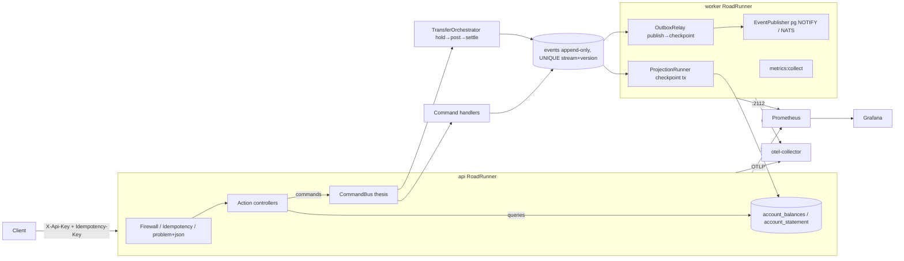

# ledger-core — design document

An event-sourced payment ledger: the backend internals of a wallet/neobank-style service, built for
correctness of money under concurrency. This document summarizes the architecture, defends its
choices against the obvious objections, and analyses how it evolves — from a brownfield legacy
system into this design, and from this scale to 100x.

## Architecture summary

**Bounded contexts.** `Accounts` (balances, holds, lifecycle), `Ledger` (double-entry journal,
balanced legs, trial balance), `Transfers` (the saga), with a `SharedKernel` (Money, Currency,
ids, clock) and infrastructure capabilities (event store, idempotency, projections, outbox,
messaging, api, observability). Contexts share the event store but never each other's internals;
the ledger checks account status through a port (`AccountStatusReader`), not a join.

**Write path.** HTTP action → command on the bus → handler/orchestrator → aggregate records events
→ `DbalEventStore::append` with expected version; the UNIQUE `(stream_type, stream_id, version)`
constraint is the concurrency guard (ADR-001). Correlation/causation/traceparent ride in event
metadata.

**Read path.** Actions read projections only; balance responses carry the projection `version` so
staleness is visible (ADR-003).

**Async path.** The event log is the outbox; the relay tails it publish-then-checkpoint
(at-least-once, consumers dedupe by event id — ADR-002); projections fold with
checkpoint-in-same-transaction (exactly-once).

## Options considered and rejected

The load-bearing rejections live in the ADRs; the map:

| Decision | Rejected alternatives | Where |
| --- | --- | --- |
| Event-sourced write side | CRUD + audit table; CDC-derived audit; ES framework | ADR-001 |
| Log-as-outbox + checkpoint relay | Dual-write; separate outbox table; Debezium/Kafka CDC; broker-first | ADR-002 |
| Async rebuildable projections | Synchronous projection in write tx; replay-per-read; read-your-writes middleware | ADR-003 |
| Plain tables for idempotency/read models | Event-source everything; Redis for idempotency | ADR-004 |
| Synchronous saga orchestrator | Choreography; 2PC; async process manager (deferred, not refused) | ADR-005 |
| Upcast-on-read versioning | In-place migration; `??`-tolerance; versioned event classes | ADR-006 |

Cross-cutting rejections not covered by an ADR: **Doctrine ORM on the write side** (an identity-map
ORM buys nothing for append-only streams; raw DBAL keeps the SQL visible); **framework message bus
with async transport for commands** (commands are handled in-process synchronously via
thesis/message-bus's core `Handlers` — an HTTP request needs the outcome; queries skip the bus
entirely); **nelmio/swagger for OpenAPI** (a reflection generator over the Action classes keeps the
contract code-derived with zero annotations drift).

## Brownfield evolution path

Suppose the incumbent is a legacy mutable-balance system — one `balances` table, millions of
postings in an append-only `postings` table (or worse, without one) — that cannot take downtime.
Migration is a **strangler with dual-write and a parity gate**, reversible at every step:

1. **Shadow writes (legacy leads).** A thin adapter in the legacy write path emits the equivalent
   domain event (`FundsDeposited`, `FundsDebited`, …) into the ledger-core event store for every
   legacy mutation, in the same unit of work where possible, else via the legacy system's own
   transaction log. Legacy remains the source of truth; ledger-core is a dark replica. The event
   streams are seeded per account with an `AccountMigrated` opening event carrying the balance at
   cutover-zero, so streams don't need the full prehistory.
2. **Backfill history (optional depth).** Where regulators need pre-migration history queryable in
   the new system, translate legacy postings into events *behind* the opening event as a separate
   read-only stream — never interleaved with live writes.
3. **Parity gate.** Projections build balances from the shadow events; a reconciliation job
   compares `account_balances` with the legacy table continuously (count, sum, per-account diff)
   and publishes a parity metric. Weeks green, not minutes. The double-entry trial balance
   (`sum(debits) = sum(credits)`) must also hold on the new side.
4. **Read cutover.** Reads move to ledger-core projections behind a flag, account cohort by
   cohort. Writes still hit legacy. Any wobble: flip the flag back — reads are stateless consumers.
5. **Write cutover (the only one-way-ish door).** Per cohort: freeze the account for milliseconds
   (reject-and-retry, not downtime), verify parity for that account, then route its commands to
   ledger-core; the shadow adapter reverses direction (ledger-core events → legacy table updates)
   so **rollback stays possible** — legacy is now the dark replica.
6. **Decommission.** After a full accounting period of green parity with legacy dark, stop the
   reverse writes, archive the legacy tables.

Rollback at any stage is "flip the router back"; the dual-write adapters are the cost, the parity
metric is the safety, and at no point do two systems both believe they own an account's writes.

## 100x scaling analysis

Take current demo scale to 100x (say, thousands of transfers/second sustained). What breaks, in
order:

1. **The single relay/projection tailer breaks first.** One serial consumer per concern reading
   the global stream caps end-to-end freshness; `projection_lag_seconds` and `outbox_pending`
   climb long before PostgreSQL struggles. *Mitigation:* partition consumers by `stream_id` hash —
   per-stream order is the only order the folds need (balances are per-account; the statement is
   per-account). N projection workers each own a partition with its own checkpoint row; same for
   relays. The schema needs nothing new; the runner needs a partition predicate. LISTEN/NOTIFY
   wake-ups replace polling before that.
2. **Event-store write hot-spotting second.** Raw append throughput is fine (single INSERT per
   event, one index), but two pressure points emerge: the `global_position` sequence serializes
   position assignment (contention appears in the tens of thousands of events/sec), and **hot
   accounts** (a merchant settlement account) serialize on expected-version conflicts by design.
   *Mitigation:* for the sequence — batch appends per transaction and/or move to per-partition
   ordering (consumers already only need per-stream order). For hot accounts — split into
   sub-accounts rolled up by projection (the standard ledger answer), and add retry-with-jitter on
   `ConcurrencyConflict` (a `409` is already the client contract).
3. **Stream length / replay cost third.** Rehydrating a years-old busy account on every command
   gets slow. *Mitigation:* snapshots — persist aggregate state every N events, replay only the
   tail (snapshot state is derived data, deletable at will, and per ADR-006 stores post-upcast
   shape). The `AggregateRoot` seam (`reconstituteFromHistory`) is where it plugs in.
4. **PostgreSQL as the bus last.** LISTEN/NOTIFY and a polling relay are fine to ~10³ msg/s;
   beyond, swap the `EventPublisher` port to NATS JetStream (the port exists precisely for this)
   and let projections consume the broker with the same idempotent-by-event-id discipline.
5. **What doesn't break:** the API tier (stateless, HPA already scales it), idempotency
   (unique-constraint INSERT scales with the table; add TTL partitioning when it grows), and the
   double-entry invariant (per-entry, not global).

The honest summary: the design's scaling story is *partition by stream* — the aggregate-per-stream
model was chosen so that ordering requirements, and therefore parallelism limits, are per-account,
not global.

## Cost and on-call

**Footprint.** Steady state is deliberately small: one PostgreSQL (the only stateful component —
size it for the events table and give it real backups/PITR), N api pods and ≥1 worker pod of the
same image, Prometheus/Grafana/otel-collector as shared infrastructure. No broker, no cache tier,
no search cluster; total marginal cost is roughly "a database plus a handful of small pods". CI
cost is bounded (unit-scoped mutation testing at ~2s; kind smoke only on main).

**On-call surface.** Three alerts, each with a runbook play (`docs/runbook.md`): projection lag
(reads stale — degraded, not down), outbox backlog (consumers behind — degraded), p99 latency SLO
burn, plus scrape-loss. The failure domains are forgiving by construction: the write side keeps
accepting and recording money movements even if every read model and the relay are down; nothing
downstream can corrupt the log; a stuck transfer parks funds in `reserved` rather than losing them.
The worst genuine page is PostgreSQL itself — which is why it's the one component to spend money
on. Realistic expectation: low-single-digit pages per month, mostly "restart the worker /
rebuild a projection" class.
